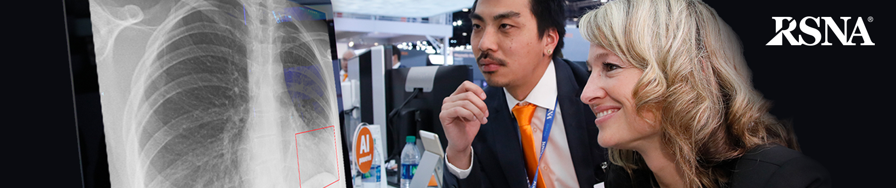

# py-pneumonia-detection

This repository is an implementation of Mask R-CNN for the RSNA Pneumonia Detection Challenge on Kaggle. The model generates bounding boxes and segmentation masks for each instance of an object in the image. It's based on Feature Pyramid Network (FPN) and a ResNet101 backbone.

The repository includes:
* Source code of Mask R-CNN built on FPN and ResNet101.
* Training code for RSNA Kaggle
* Pre-trained weights for MS COCO and RSNA Kaggle
* Jupyter notebooks to visualize the detection pipeline at every step
* Evaluation on RSNA metrics (Loss, accuracy, precision, and recall)

